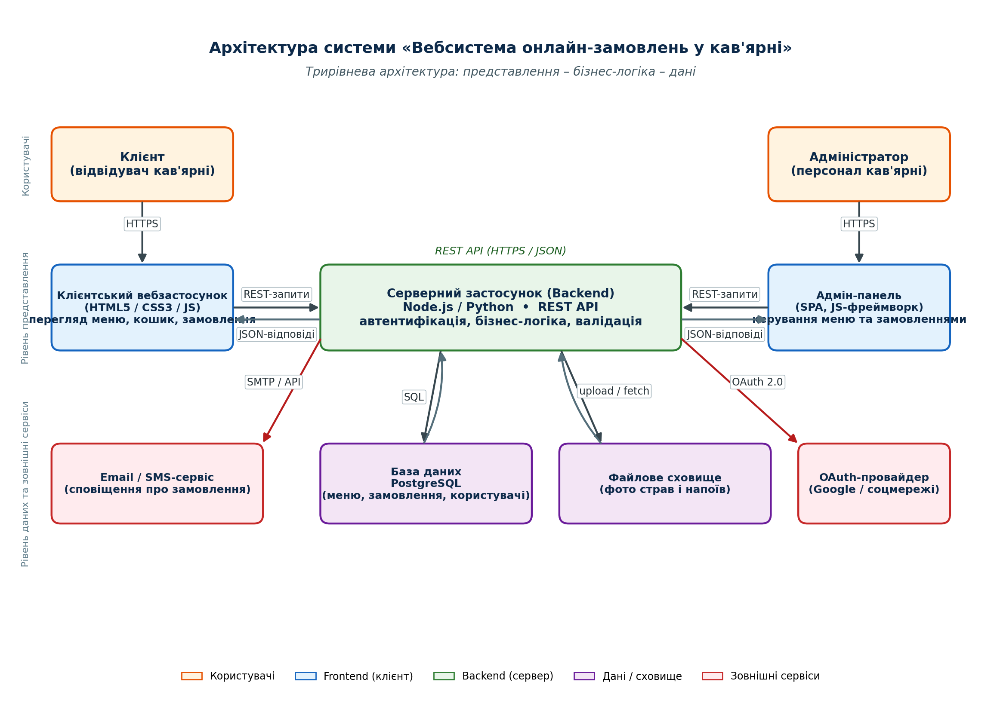

# Coffee Orders — вебсистема онлайн-замовлень у кав’ярні

Стабільний MVP `v1.0.0` курсового проєкту: REST API на Node.js / Express 5 + Prisma 6 + PostgreSQL 18 і SPA-клієнт на React 19 / TypeScript / Vite.

## Структура репозиторію

```
.
├── backend/      # Node.js + Express 5 + Prisma 6 + PostgreSQL
├── frontend/     # React 19 + Vite 7 + TypeScript 5.9
├── *.py          # генератори звітів практичних робіт (python-docx)
├── *.docx        # згенеровані звіти й інструкція користувача
└── architecture_diagram.png
```

## Швидкий старт

### Backend

```bash
cd backend
cp .env.example .env
docker compose up -d postgres
npm install
npx prisma migrate deploy
npx prisma db seed
npm run dev          # http://localhost:3000
```

### Frontend

```bash
cd frontend
cp .env.example .env  # VITE_API_BASE_URL=http://localhost:3000/api
npm install
npm run dev          # http://localhost:5173
```

Повна технічна документація — у файлі `Звіт_Практична_32_Технічна_документація.docx`.
Інструкція для кінцевого користувача — `Інструкція_користувача_Coffee_Orders.docx`.

## Архітектура



## Ліцензія

Навчальний проєкт. Автор: lazar1n-yt, 2026.
